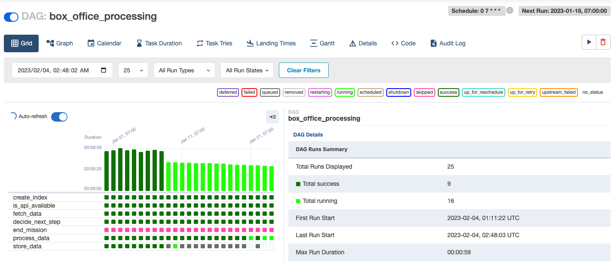

# movie-box-office
Automatically collect daily movie box office on [DATA.GOV.TW(政府資料開放平臺)](https://data.gov.tw/dataset/94224), 
and count the most popular movies within 7days. Show statistics with Kibana.

## Services I used in this project
- Docker（for building enviroment）
- Airflow (for developing, scheduling, and monitoring batch-oriented workflows)
  - developed a GAD to process data from open source data to ElasticSearch
  - developed a Hook class to access and load data into ElasticSearch
- ElasticSearch (a database for saving data)  
- Kibana (a visualization tool for building dashborads)  

## Monitoring workflow operation
  

## Workflow(DAG) 
  

## Dashboard to display Top5 moives
  
